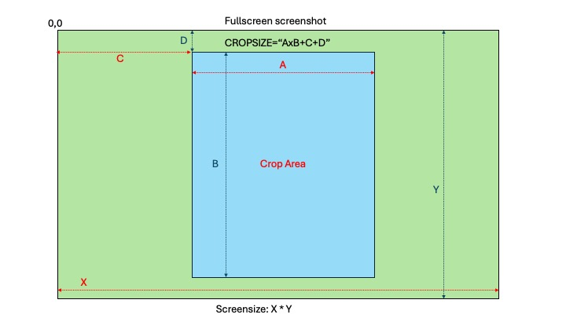

# Creating PDF from multiple screenshot image

This script is to create PDF file from multiple screenshot image.

The script has been tested on MACOSX or Windows 11 (using WSL)

# software required for this script to run
- Python3
- ImageMagick
# Cropsize reference
This is the reference for CROPSIZE variable

# Work flow
1. Determine the CROPSIZE, based on your system (Windows 11 or MACOSX) and screen resolution
2. change variable SOURCEDIR to the default directory when screenshot file is stored. For example for MACOSX it will be "/Users/UserName/Desktop", for Windows 11 (under WSL) it will be "/mnt/c/Users/UserName/OneDrive/Pictures/Screenshots"
3. Open the application (for example ebook reader) and put it in fullscreen mode.
4. Do screenshot, on MACOSX press SHIFT+COMMAND+3 , on Windows 11 press WindowsKey+PrtScr
5. On the application, go the next page, repeat step 4
6. repeat Step 4 - 5 until all pages are captured
7. Drop to shell/terminal, and run the script [create_pdf.py](./create_pdf.py)
8. File **result.pdf** is the output for the script.
9. Move file **result.pdf** to other directory and rename it.
10. Repeat 4 - 9 for the next pdf file.

# Caveat
- limit the number of pages per PDF below 100. if the page numbers are too big, the process of converting the image to pdf may fail

